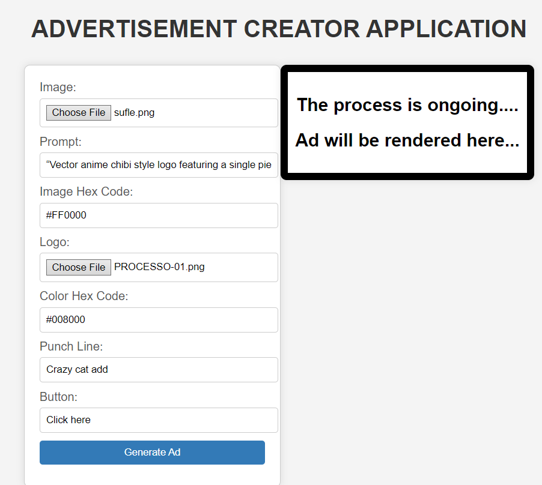
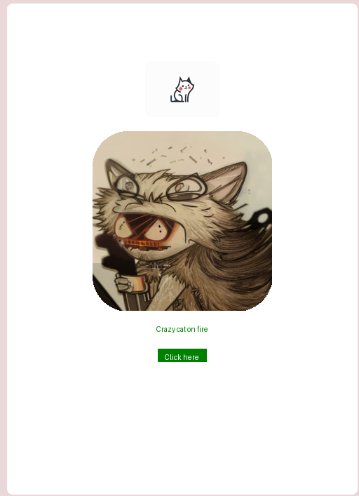

# Dynamic Image Advertising Template Generator

This project implements a Python application that leverages Stable Diffusion for image generation, FastAPI for API development, HTML for user interaction, and Docker for deployment on Hugging Face Spaces.

## Table of contents
* [General Info](#General-Info)
* [Usage](#Usage)
* [Project Structure](#Project-Structure)
* [Furher Improvements](#Further-Improvements)
* [Author](#Author)

## General Info
The project's main objective is to generate new images resembling a provided stock photo using Stable Diffusion's Img2Img pipeline. FastAPI is utilized to create an API endpoint, enabling users to input image, text prompt, and color(hex code), and receiving a generated image in return. The HTML interface facilitates user interaction, displaying the resulting image. Docker is employed for containerization and deployment on Hugging Face Spaces.

### Task
- Utilized Stable Diffusion's Img2Img pipeline to generate images resembling a provided stock photo.
- Use the generated image along with other specified inputs to craft a basic dynamic advertising template.
- Created an API endpoint using FastAPI to receive inputs and return generated images.
- Implemented an HTML interface for user interaction and image display.
- Dockerized the application for easy deployment on Hugging Face Spaces.

### Important Note

Please note that due to the computational complexity of the image rendering process, it may take approximately 5-10 minutes to generate a single ad template.

## Usage

visit the following link: [Ad Fast Api Space](https://huggingface.co/spaces/suleymanerim1/ad_fast_api/tree/main/templates)

| Usage Example <br> <sub>(Click to enlarge)</sub> | Result Example <br> <sub>(Click to enlarge)</sub> |
|-------------------------|------------------------|
|  |  |

## Project Structure
```bash
├── templates
│   ├── ad_display.html
│   ├── get_input.html
├── main.py
├── ad_creator.py
├── README.md
└── requirements.txt
```
## Further Improvements

1. **GPU Utilization:** Enhance image generation speed by integrating GPU acceleration, leveraging parallel processing power to expedite the creation of images.
2. **Stable Diffusion Enhancement:** Explore hyperparameter tuning, model selection, ensemble methods, transfer learning, and community research to optimize the Stable Diffusion model for improved image generation results.
3. **Image Format Flexibility:** Implement the capability to handle multiple image formats such as JPG, BMP, and others, expanding compatibility for image inputs and outputs.
4. **Enhanced HTML Hex Code Support:** Address limitations with the webcolors library by extending the range of HTML hex code support. This improvement will broaden the application's ability to accurately interpret and utilize a wider spectrum of HTML hex color codes for user inputs.

## Author
- Suleyman Erim

